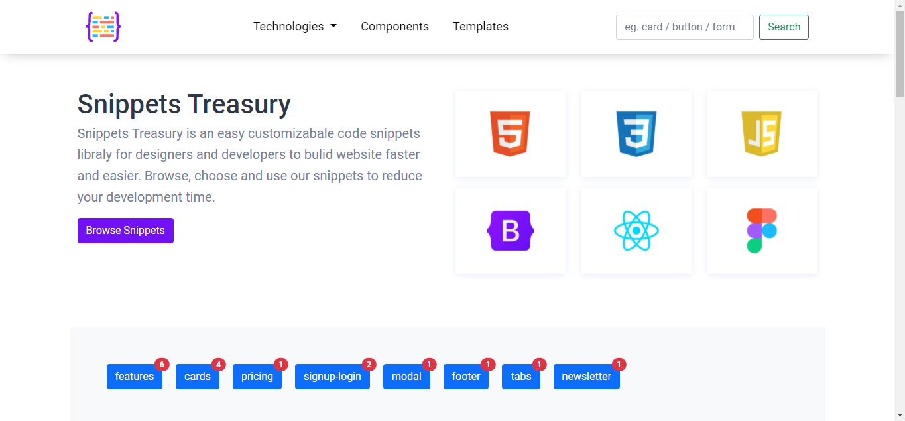

<p align="center">
    
</p>
  <h2 align="center">Snippets Treasury</h2>

## About this project

Snippets Treasury is an easy customizabale code snippets libraly for designers and developers to bulid website faster and easier. Browse, choose and use snippets to reduce your development time.

<p align="center">
    
</p>

## Set up and run

### Clone

```bash
https://github.com/shahriarshafin/snippets-treasury.git
cd Iot-car-controller
```

### Start server

Start a static server in the root.

Open in the browser.

e.g.

- http://127.0.0.1:8000/
